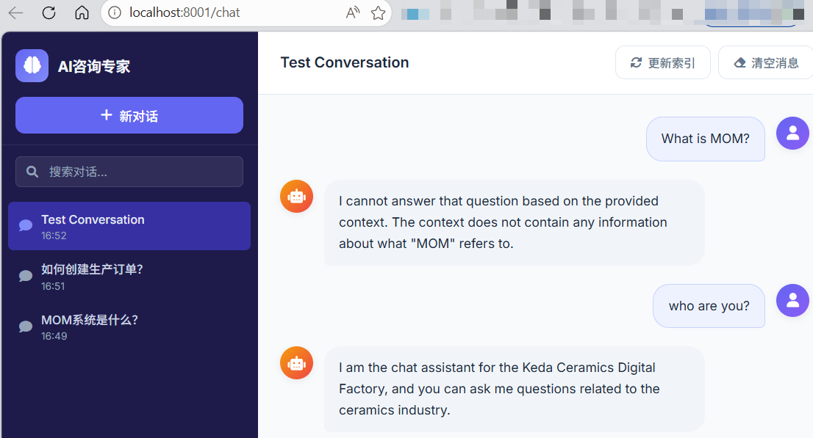

# 原视界 AI 咨询专家

基于 FastAPI + LlamaIndex 的 RAG 智能问答系统，支持流式对话、对话持久化和多会话管理。



## 项目结构

```
├── server.py              # FastAPI 主服务
├── config.py              # 配置加载模块（YAML + 环境变量）
├── config.example.yaml    # 配置文件模板
├── config.yaml            # 实际配置（含 API Key，已 gitignore）
├── pyproject.toml         # 项目依赖
├── templates/
│   └── chat.html          # 聊天界面
├── static/                # 静态文件
├── data_dir/              # 知识库文档 + SQLite 数据库
├── llms/                  # 模型缓存目录
└── imgs/                  # 截图
```

## 快速开始

### 1. 配置

```bash
cp config.example.yaml config.yaml
```

编辑 `config.yaml`，填入真实的 API Key：

```yaml
llm:
  api_key: "your-deepseek-api-key"

aliyun:
  access_key_id: "your-aliyun-key"
  access_key_secret: "your-aliyun-secret"
```

> 敏感字段也支持通过环境变量覆盖，如 `APP_LLM__API_KEY=sk-xxx`。

### 2. 安装依赖

```bash
pip install -r requirements.txt
# 或使用 uv
uv sync
```

### 3. 启动服务

```bash
python server.py
# 或指定端口
python server.py --port 8080
```

访问 `http://localhost:8001/chat` 开始使用。

## 功能特性

- **流式对话** — AI 回复逐字输出，阅读体验流畅
- **对话持久化** — SQLite 存储所有对话和历史消息，刷新不丢失
- **多会话管理** — 侧边栏管理多个对话，支持搜索、重命名、删除
- **RAG 检索增强** — 基于知识库文档的智能问答
- **配置分离** — API Key 等敏感信息从配置文件加载，支持环境变量覆盖
- **响应式设计** — 适配桌面和移动端

## API 接口

| 方法 | 端点 | 说明 |
|------|------|------|
| GET | `/chat` | 聊天界面 |
| POST | `/stream-query` | 流式 RAG 查询 |
| POST | `/update-index` | 更新知识库索引 |
| GET | `/api/conversations` | 获取对话列表 |
| POST | `/api/conversations` | 创建新对话 |
| DELETE | `/api/conversations/{id}` | 删除对话 |
| PUT | `/api/conversations/{id}` | 重命名对话 |
| GET | `/api/conversations/{id}/messages` | 获取对话消息 |
| POST | `/api/conversations/{id}/messages` | 添加消息 |

## 技术栈

- **FastAPI** — 异步 Web 框架
- **LlamaIndex** — RAG 检索增强生成
- **DeepSeek** — 大语言模型
- **HuggingFace** — 嵌入模型 (bge-small-zh-v1.5)
- **SQLite** — 对话数据持久化
- **Jinja2** — 模板引擎
